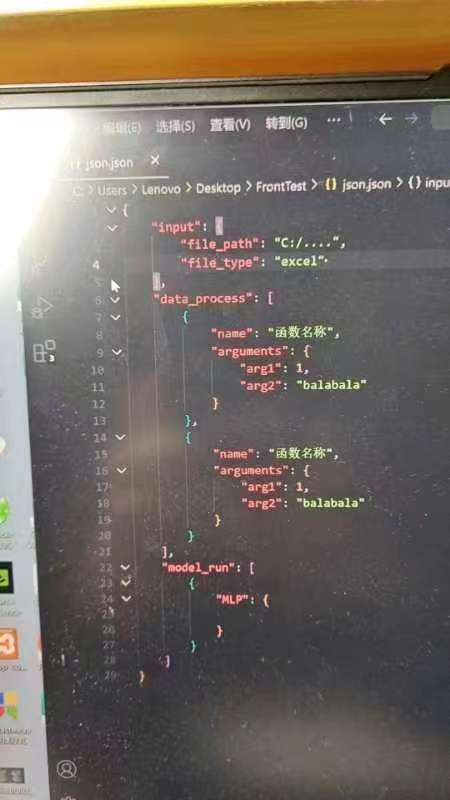

# 火烧云日志
## ~10.30
Python各模块大致完成，但仍需对各个**函数参数**、**函数输出**、**函数体**进行详细地检查。以及total_execution需要再商榷。

## 11.01
重要的任务：
①确保数据在经过预处理过后，输出接口就要和主体模型输入接口对上，以实现训练功能。
②对于检验集和测试集共存的主体模型，先写出两者一起处理的导入函数和预处理函数，再一并传入主体模型中。
③对于用户输入预测数据的阶段，再写出一个execution.py文件，分开执行(注意处理json)，也许可以提高性能。
④如果还不会用Apifox进行测试，那就先在自己调用函数看看能不能正常运作，如果可以，那么就是传json的问题了。
⑤确认可视化应该是要如何完成的。

## 11.04
todolist:
task_total are as follows:

①确认按照每种任务给每个模块分类是不是会好一些

## 11.06
### 组会记录:
#### Python流程: 
- java端发送json到execution，其中这个json一共包含了数据读取、数据预处理、模型运行三大块，json的格式大致如下：



- 对于每个模块中的json，如果json的键值对中存在空value值，那么函数应该使用默认参数。可以选择使用解字典的方式映射传入参数。即**dict传入参数，不过要先清洗字典，示例代码如下：
  
```
# 假设json_data中一些键可能存在但值为空
json_data = {"arg1": "a", "arg2": '' }

# 删除所有值为空的键
cleaned_dict = {k: v for k, v in json_data.items() if v is not None and v != ''}

# 使用清理后的数据调用函数
function_with_params(**cleaned_data)
```

- execution中的执行过程，先是读取任务，再读取data_preprocessing中的函数名称，找到对应的函数进行赋值，再读取函数的参数字典，将上一轮的数据传入这个字典当中，再对字典进行清洗，将参数解字典传入函数参数列表中，得到新的数据，开始进入下一轮的操作。最终输出一个模型

- 并且整个任务中最重要的是实现一个可以自由搭配神经网络数量的模型，到星期三之前先建立一个MLP即全连接神经网络模型，尝试读取线性层进行小模块的自由组装。问问gpt4具体如何实现。

- 除此之外，整理一份文档发给java和前端，整理出对应每个任务当中每个函数的必选参数和可选参数。

- 在星期三左右，实现可视化模块的对接。
